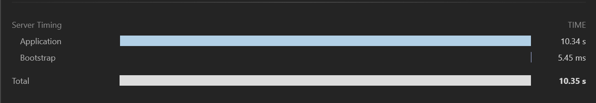
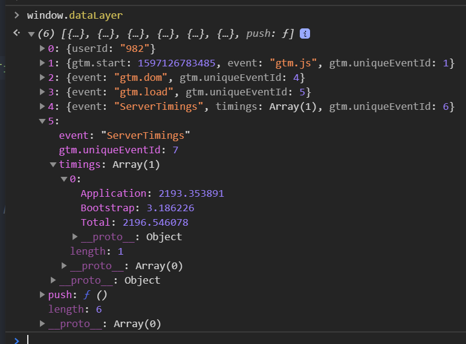

## Introduction
This module allows developers to add Server-Timing information to headers for a SilverStripe application. 

The [Server Timing API](https://w3c.github.io/server-timing/) allows you to pass request-specific timing data from the server to the browser via response headers.

This is an example of the Server Timing header information looks in development tools of Chrome:



## Requirements
* SilverStripe Framework ^4.0

## Installation

```
composer require internetrix/silverstripe-server-timing
```

## Configuration
It is recommended to add the `\Internetrix\Control\Middleware\ServerTimingMiddleware::class` to the top of the middleware execution pipeline.
This will require the middleware to be added before the SilverStripe CMS has been fully bootstrapped.

To do so we can edit the SilverStripe CMS entry point file located either at `public/index.php`, or directly in your project root at `index.php` if your project doesn't use the public web root.

Find the line that instantiates `HTTPApplication`. Call the `addMiddleware` method on the `HTTPApplication` instance and pass it an instance of the `ServerTimingMiddleware` class. Remember to pass it an instance of `ServerTiming`:
```
$app = new HTTPApplication($kernel);

// Add the following line to configure our ServerTimingMiddleware
$app->addMiddleware(new ServerTimingMiddleware(ServerTiming::inst()));

$app->addMiddleware(new ErrorControlChainMiddleware($app));
$response = $app->handle($request);
$response->output();
```

By default the following metrics is added to the response headers:
- <b>Bootstrap:</b> Time until it takes for the `ServerTimingMiddleware` to be called
- <b>Application:</b> Time it takes to receive a response from the SilverStripe application.
- <b>Total:</b> The total duration being a request being sent to server until right before a response being sent back to the client-side.
 
## Adding more timing metrics
A developer can also add more timing-metrics to the header by using `start` and `end` methods on the `Internetrix\Helper\ServerTiming` class.
Please note that the name of the metric should be passed as the parameter and needs to be the same for `start` and `stop`. 

The `start` and `stop` methods can be called from within different parts of the SilverStripe application.
```
ServerTiming::start('Custom Metric to Measure');
// do something in the code
ServerTiming::end('Custom Metric to Measure');
```

Alternatively, we can also use the `addMetric` method on `ServerTiming` when we want to measure a metric from the start of the request.
The duration for the metric will then be calculated using the start time of the request and the current time.

```
// add a metric that measure the time between the start of the request and now
ServerTiming::addMetric('Metric to Add');
```

## Client-Side Analytics Integration
<b>Note</b>: The interface may only available in secure contexts (HTTPS) in some browsers.

The default and custom timing metrics defined in the Server-Timing headers can be retrieved on the client-side for third-party Analytics integration (i.e Google Analytics) using the PerformanceObserver Web API using JavaScript. 
<br><br>
Add the following script to the base `Page.ss` template file and/or any pages before the `</body>` tag you want the server-timing API information to be retrieved on the client-side. The script will push all server-timing metrics data to a global `dataLayer` JavaScript variable which can then be used for analytics. 
```
<script>
    try {
            window.dataLayer = window.dataLayer || [];
            serverTimings = {};
            // Create the performance observer.
            const po = new PerformanceObserver((list) => {
                for (const entry of list.getEntries()) {
                    // Logs each server timing data for this response to object
                    if ('serverTiming' in entry) {
                        entry.serverTiming.forEach(function (timing) {
                            let name = timing.name;
                            serverTimings[name] = timing.duration;
                        });
                    }
                }
            });
            // Start listening for `navigation` entries to be dispatched.
            po.observe({type: 'navigation', buffered: true});
            // Push all the server timing object to the datalayer as a new event
            dataLayer.push({
                'event' : 'ServerTimings',
                'timings' : [serverTimings]
            });
        } catch (e) {
            // Do nothing if API is not support by browser
        }
</script>
```

This is an example of how the default Server-Timing metrics are stored within the global `dataLayer` variable:<br><br>


## Credits
This module was inspired and based on the following package for the Laravel framework: 

https://github.com/beyondcode/laravel-server-timing.

It has been refactored to be compatible with the SilverStripe framework.

## Licence
Please see [License File](LICENSE.md) for more information.
